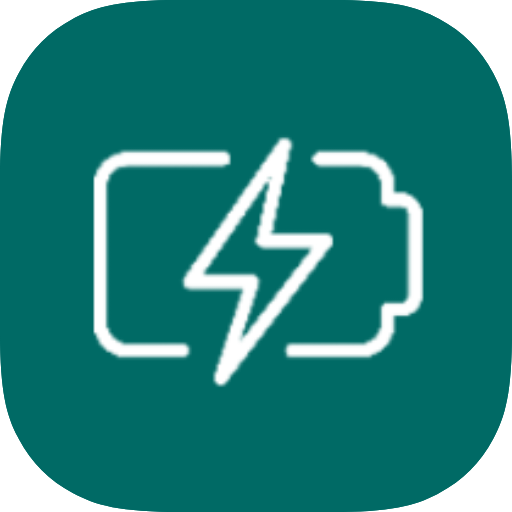

  

<h1 align="center">Shizu Isolation</h1>

  <i>Lock your USB. Protect your data. No root required.</i>

---

Shizu Isolation is an Android app that protects your data with one tap.
This APK locks your USB port to charging-only mode instantly, blocking
unauthorized data access from untrusted computers, public chargers, or
unknown devices. Simple, lightweight, and no root required — powered by Shizuku.

---

## Screenshots

  
  
  

---

## Features
- 🔒 **Isolate** — Lock USB to charging-only, zero data transfer
- 🔓 **Restore** — Switch back to MTP file transfer anytime
- ⚡ No background services, no battery drain
- 🛡️ No root required
- 📦 Lightweight APK

---

## Requirements
- Android 10+
- [Shizuku](https://shizuku.rikka.app/) installed and running

---

## Installation
Download the latest APK from [Releases](../../releases/latest)

> ⚠️ Enable **Install from unknown sources** in your Android settings before installing.

---

## How It Works
Shizu Isolation uses Shizuku to execute a privileged ADB command that
sets `usb_configuration` — the same way you would via ADB on a PC,
but entirely from your phone. No root, no PC required.

---

## Credits

**App Icon**
Energy icons created by [Pixel perfect](https://www.flaticon.com/authors/pixel-perfect) — [Flaticon](https://www.flaticon.com/free-icons/energy)

**Powered By**
[Shizuku](https://github.com/RikkaApps/Shizuku) by RikkaApps

---

## Legal

Copyright © 2026 Musaddiq Baluch. All rights reserved.

This application and its source code are the exclusive property of the
author. No part of this project — including but not limited to the source
code, design, assets, or documentation — may be reproduced, distributed,
modified, or used in any form without explicit written permission from
the author.

> Unauthorized use, copying, or distribution of this application or any
> of its components is strictly prohibited.
